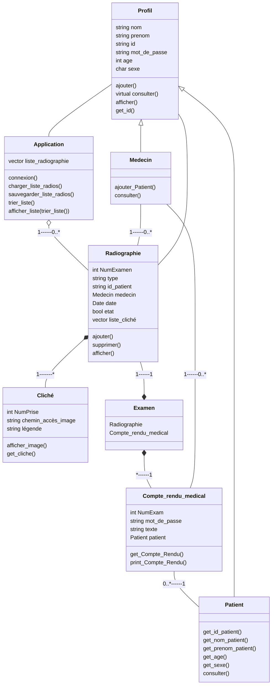

<a name="readme-top"></a>
<!-- PROJECT SHIELDS -->
<!-- PROJECT TITLE -->
<br />
<div align="center">
  <a href="https://github.com/Annewynn/POO_project">
    
  </a>

  <h1 align="center"></h1>

  <p align="center">
    Une application pour la consultations d'examens réalisées, et des radiographies associées, ainsi que la saisie de nouvelles radiographies.
    <br />
    <a href="https://github.com/Annewynn/POO_project">Home</a>
    ·
    <a href="https://github.com/Annewynn/POO_project/issues">Report de bugs</a>
    ·
    <a href="https://github.com/Annewynn/POO_project/issues">Requêtes de fonctionnalités</a>
  </p>
</div>


<!-- TABLE OF CONTENTS -->

# Projet en Programmation Orientée Objet: _Logiciel pour un centre de radiologie_
Dans un cabinet de radiologie, il est nécessaire de pouvoir facilement consulter des radiographies associées à des examens sur une base de données numériques. Il est également nécessaire de pouvoir y enregistrer des examens, avec les contre-rendu et la radiographies associées.  
Pour se faire nous proposons ce logiciel, **P.O.O FM**, utilisable simplement à partir d'un terminal et sans avoir besoin d'accéder manuellement aux fichiers de la base de données. 

## Schéma U.M.L. de l'architecture du logiciel
Pour faciliter la compréhension et la lisibilité du code du logiciel, un schéma récapitulatif en UML a été réalisé.  

Le logiciel est centré sur l'utilisation de classes pour les différents éléments de la base de donnée à gérer. L'organisation et les relations entre ces différentes classes est réprésentées sous la form de lien d'hérédité, de composition ou encore de relation simple. Il est également indiqué la composition et les actions possibles de chaqu'une des instances de ces différentes classes.



## Documentation
### Construction du logiciel:
* [![C++][C++-shield]][C++-url]
* [![Mermaid][mermaid-shield]][mermaid-url]

### Utilisation du logiciel
Ce utilise uniquement le language C++ et ne nécessite donc aucuns prérequis. Il suffit de lancer le fichier _main_.
```bash
./main
```

### Dépendances nécessaires
Les packages utilisées ne sont pas des packages extérieurs. Leur liste:
- iostream
- string
- fstream
- sstream
- vector
- sys/stat.h
- filesystem

## Plan de finalisation du logiciel
- [ ] Fonctionnalités élémentaires
  - [x] Interface de connection lors du lancement.
  - [x] Pouvoir accéder aux examens (radiographies et clichés associés + compte rendu)
  - [ ] Pouvoir créer et sauvegarder des examens/radiographies.
  - [ ] Pouvoir afficher la liste des examens/radiographies.
- [ ] Fonctionnalités supplémentaires
  - [ ] Ajouter des fonctionnalités pour les patients
  - [ ] Affichage des clichés associés aux radiographies
  - [ ] Utilisation d'un racourcie pour éviter de passer par le terminal.

Pour avoir une liste des fonctionnalités proposées (et bugs découverts), suivé ce [lien](https://github.com/Annewynn/POO_project/issues).

## Disclaimer & Copyright
P.O.O FM est une application en développement.  
Les auteurs demandent que tout travail nécessitant l'utilisation de cette application incorpore une référence au [github](https://github.com/Annewynn/POO_project), ainsi que les références suivantes:  
  _BOUCHEREAU E., GUILLON N._ "P.O.O FM: Logiciel de gestion de radiographies", 2022

## Références
<a href="https://www.flaticon.com/fr/icones-gratuites/mri" title="mri icônes">Mri icônes créées par mavadee - Flaticon</a>

<p align="right">(<a href="#readme-top">back to top</a>)</p>


<!-- MARKDOWN LINKS & IMAGES -->
<!-- https://www.markdownguide.org/basic-syntax/#reference-style-links -->

[C++-shield]: https://img.shields.io/badge/C++-Orient%C3%A9_objet-blue.svg?style=for-the-badge&logo=c%2B%2B
[C++-url]: https://cplusplus.com/
[mermaid-shield]: https://img.shields.io/badge/mermaid-UML-blue.svg?style=for-the-badge&logo=JavaScript
[mermaid-url]: https://mermaid-js.github.io/
