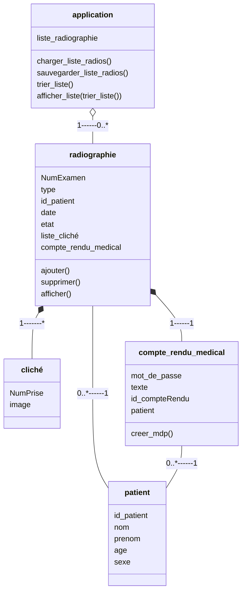

# Projet en Programmation orientée objet
## Logiciel pour un centre de radiologie

```mermaid
classDiagram
radiographie -- patient : 0..*------1
radiographie *-- cliché : 1-------*
radiographie *-- compte_rendu_medical : 1------1
application o-- radiographie : 1------0..*
compte_rendu_medical -- patient : 0..*------1

radiographie: NumExamen
radiographie: type
radiographie: id_patient
radiographie: date
radiographie: etat
radiographie: liste_cliché
radiographie: compte_rendu_medical
radiographie: ajouter()
radiographie: supprimer()
radiographie: afficher()

cliché: NumPrise
cliché: image

compte_rendu_medical: mot_de_passe
compte_rendu_medical: texte
compte_rendu_medical: id_compteRendu
compte_rendu_medical: patient
compte_rendu_medical: creer_mdp()

application: liste_radiographie
application: charger_liste_radios()
application: sauvegarder_liste_radios()
application: trier_liste()
application: afficher_liste(trier_liste())

patient: id_patient
patient: nom
patient: prenom
patient: age
patient: sexe


```